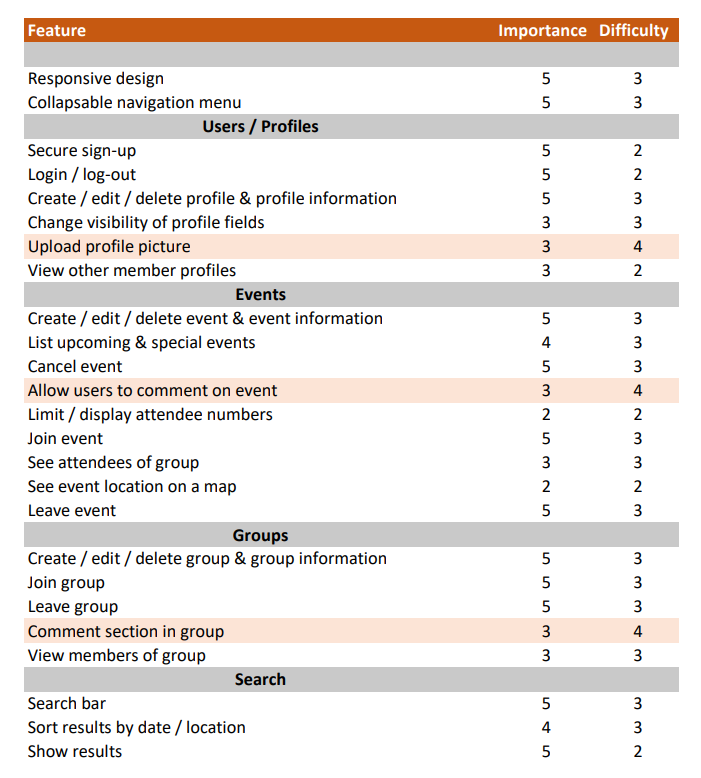
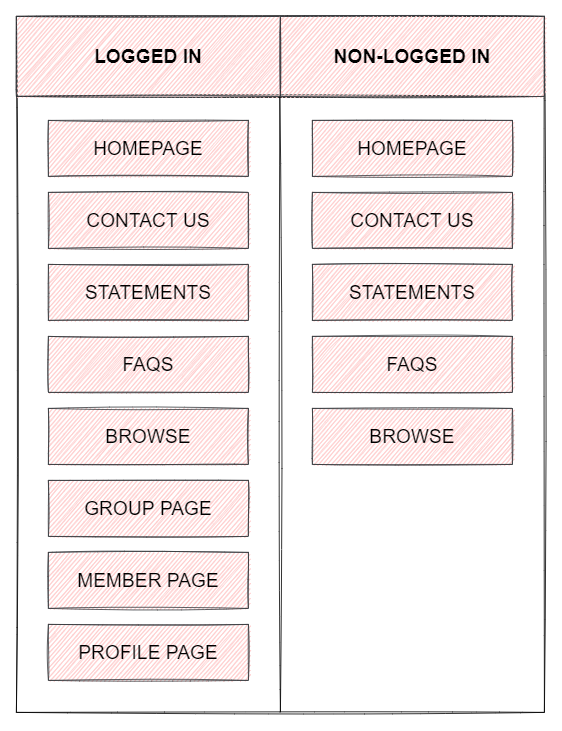
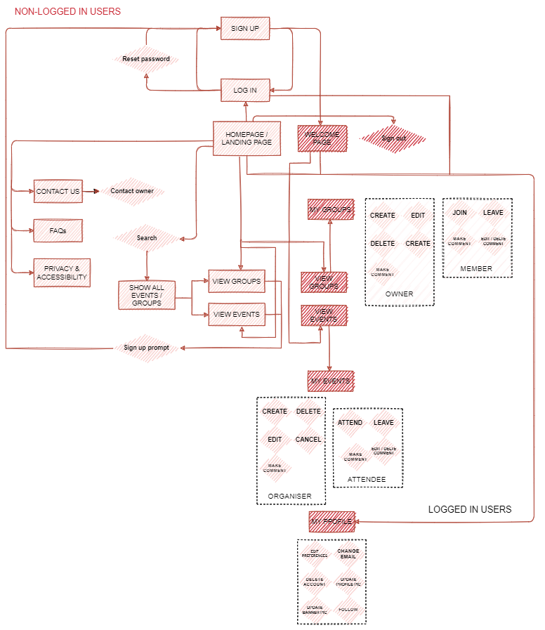

# MS3 - Worldsmiths
Worldsmiths is an online event-planning platform and was created for educational purposes as the 3rd milestone project of the Code Institute's Full Stack Software Development Diploma.

This website is fully responsive and interactive, and was developed using HTML, CSS, JavaScript, Python, Flask and MongoDB, incorporating the principles of UX design and adhering to PEP8 compliance.

# Table of Contents
* [UX]()
    * [Strategy]()
    * [User stories]()
    * [Scope]()
    * [Structure]()
    * [Skeleton]()
    * [Design]()
* [Features]()
    * [Existing features]()
    * [Features for future implementation]()
* [Technologies]()
    * [Languages]()
    * [Database]()
    * [Libraries & frameworks]()
* [Code organisation]()
* [Validation]()
* [Testing]()
* [Deployment]()
* [Credits]()

# UX
## **Strategy**

***Introduction***

*Worldsmiths* is an event-planning platform aimed at the [worldbuilding](https://en.wikipedia.org/wiki/Worldbuilding) community within in the UK. Worldbuilding is considered a niche hobby, and has a vibrant and diverse community spanning the globe. This site is aimed at those within the UK community who wish to network for a variety of reasons, including:
* Discuss, develop and learn about worldbuilding skills & practices
* Create a profile in order to share their projects with others on the website
* Opportunities to meet authors & creators through special events
* Socialise with other members of the community around the country

***Site owner goals***
* Provide worldbuilders in the UK an engaging and easy-to-use platform to create and join events, share their profiles and network
* Put new language skills (Python, MongoDB and Flask) into practice
* Create and minumum viable product capable of being developed further in the future 

***User goals***
* Access a user-friendly platform in which to meet and engage with fellow members of the community, and create and join events
* Create a profile within the website as a member and view other profiles 

## **User stories**

***As a new user:***
* I want a responsive website so I can access it on a range of different devices
* I want to easily navigate across the site so I can find the information / page that I need  
* I want to view the site and sample the events and a profile to see if the website is something I want to join
* I want to be able to see event information for time, location and descriptions 
* I want to be able to sign-up so that I can create my profile and start networking
* I want to be able to know how to use the website so I can make the most of its features at a later date

***As a returning user (member):***
* I want to be able to log-in so that I can make use of the website and its features
* I want to be able to create and edit my profile so that I can update my personal information 
* I want to be able to choose what information I display on my profile 
* I want to be able to reset my password if I forget it 
* I want to be able to delete my profile so that my information is removed from the website
* I want to be able to leave a comment on the event page so I can connect with participants & organisers 
* I want to be able to connect with other users through their social media / emails (if provided)
* I want to be able to join a group to network with other members 
* I want to be able to view other people's profiles so that I can connect with them and view their projects
* I want to be able to share my social media or project information on my profile so that other members can see my work

***As an event/group organiser:***
* I want to be able to create an event / group so that I can network with other members
* I want to view the events that I have created so that I can edit the details or cancel it if necessary
* I want members to be able to ask questions and chat freely in the group so that any questions they have can be answered
* I want to be able to limit numbers of attendees of events so that the event is manageable in real life
* I want to provide all the relevant event details that will be of use to attendees (location, time, date, description, maps, attendees, comments section etc.)

***As an event/group participant:***
* I want to be able to join a group / event so that I can connect with other members
* I want to be able to leave the event/group if I change my mind
* I want to be able to leave comments or questions in the event/group so that I can have all the information I need 
* I want to be able to view the events and groups that I am part of 

## **Scope**

***Feature trade-off***

***Features needed for functionality***
* To be able to sign up using email address and password securely
* To be able to log in
* To be able to log out
* To be able to create / view / edit / delete profile information 
* To be able to choose visibility for profile information fields
* To be able to reset password
* To be able to create / view / edit / join / leave / cancel an event 
* To be able to create / view / edit / join / leave / delete a group
* To be able to search for events / groups according to keywords
* To be able to display search results
* To be able to sort search results by certain criteria (e.g - location)
* To be able to leave a comment in an event / group
* To be able to delete a comment in an event / group
* To be able to view other members' profiles
* To be able to upload a profile image 
* To be able to contact the site owner
* To be able to view the event location on a map
* To be able to recieve feed back for CRUD actions (create, update, delete)
* Page 404 & page 500 error (when necessary)

***Website content requirements***
* Must be clear and well laid out for easy navigation
* Information on how to use the website
* Interface must be attractive but minimal 
* Icons to aid visualisation and UI
* Clear headings and information fields

***Limitations***
* The site owner is in the process of learning Python, Flask and MongoDB which may limit the features available on the website 
* There is a time limit which may place constraints on certain elements 

## **Structure**

***Architecture***

***Workflow***

***Organisation***

* Navigation menu:
    * Guest user:
    * Logged-in user:
* Homepage:
    * Hero image:
    * Search bar:
    * "Welcome / how it works" section:
    * Upcoming events:
    * Helpful links/websites bar:
* Footer:
* Welcome page:
* Search and list events:
* Events pages:
* User profile:
* My groups:
* Groups pages:
* My events:

***Interaction***
* Collapsible menu
* Modal forms for contacting site owner
* Buttons, icons and content cards with hoverable effects

***Database structure***

*(To be added)*

## **Skeleton**
Non-logged in users can see:
* [Homepage - not logged in](documentation/wireframes/homepage-user-not-logged-in.png)
* [Sign-up page](documentation/wireframes/sign-up.png)
* [Log-in page](documentation/wireframes/log-in.png)
* [All groups and events - search results](documentation/wireframes/all-groups-events.png)
* [Event page](documentation/wireframes/event-page.png)
* [Sign in/sign up prompt](documentation/wireframes/sign-in-prompt.png)
* [Privacy & accessibility](documentation/wireframes/privacy-and-accessibility.png)
* [FAQs](documentation/wireframes/faqs.png)
* [Contact us](documentation/wireframes/contact-us.png)

Logged-in users can see:
* [Homepage - logged in](documentation/wireframes/homepage-user-logged-in.png)
* [Welcome page](documentation/wireframes/welcome-page.png)
* [User profile page](documentation/wireframes/profile.png)
* [Other user profile](documentation/wireframes/other-user-profile.png)
* [Edit profile modal](documentation/wireframes/edit-profile.png)
* [Create event](documentation/wireframes/create-event.png)
* [Event page - non-attendee](documentation/wireframes/event-page.png)
* [Event page - attendee](documentation/wireframes/event-page-attendee.png)
* [Event page - orgaiser](documentation/wireframes/event-page-organiser.png)
* [Edit event](documentation/wireframes/edit-event.png)
* [Create group](documentation/wireframes/create-group.png)
* [Group page - non-member](documentation/wireframes/group-page-non-member.png)
* [Group page - member](documentation/wireframes/group-page-member.png)
* [Group page - owner](documentation/wireframes/group-page-owner.png)
* [Edit group](documentation/wireframes/edit-group.png)
* [Settings modals](documentation/wireframes/settings.png)

## **Design**
The overall design of the website will be modern yet keeping in theme of worldbuilding genres and cartography.

***Palette***

*(To be added)*

***Typography***

*(To be added)*

***Iconography***

*(To be added)*

***Imagery***

*(To be added)*
