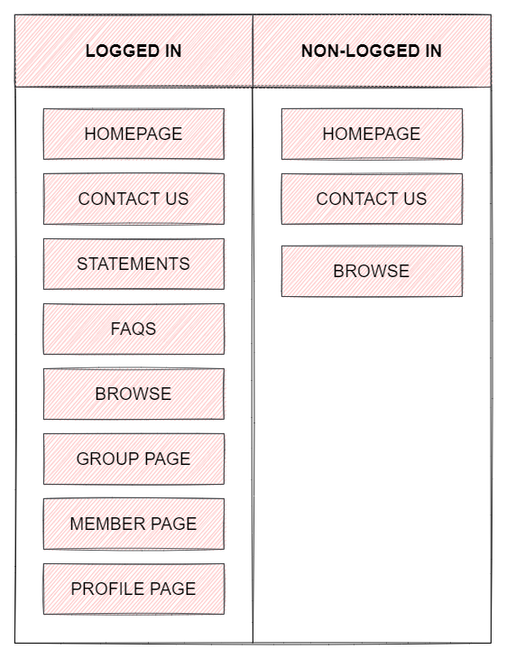
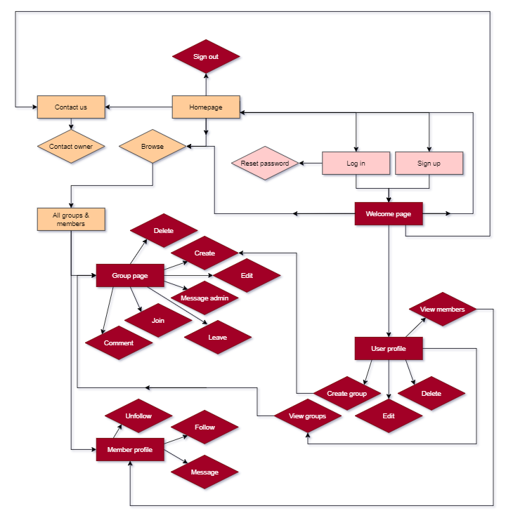
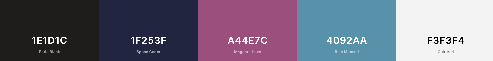

# MS3 - Worldsmiths


[Live site here](https://worldsmiths.herokuapp.com/)

Worldsmiths is an online event-planning platform and was created for educational purposes as the 3rd milestone project of the Code Institute's Full Stack Software Development Diploma.

This website is fully responsive and interactive, and was developed using HTML, CSS, JavaScript, Python, Flask and MongoDB, incorporating the principles of UX design and adhering to PEP8 compliance.

# Table of Contents
* [UX](https://github.com/lmw95/MS3-worldsmiths#ux)
    * [Strategy](https://github.com/lmw95/MS3-worldsmiths#strategy)
    * [User stories](https://github.com/lmw95/MS3-worldsmiths#user-stories)
    * [Scope](https://github.com/lmw95/MS3-worldsmiths#scope)
    * [Structure](https://github.com/lmw95/MS3-worldsmiths#structure)
    * [Skeleton](https://github.com/lmw95/MS3-worldsmiths#skeleton)
    * [Design](https://github.com/lmw95/MS3-worldsmiths#design)
* [Features](https://github.com/lmw95/MS3-worldsmiths#features)
    * [Existing features](https://github.com/lmw95/MS3-worldsmiths#existing-features)
    * [Features for future implementation](https://github.com/lmw95/MS3-worldsmiths#features-for-future-implementation)
* [Technologies](https://github.com/lmw95/MS3-worldsmiths#technologies)
    * [Languages](https://github.com/lmw95/MS3-worldsmiths#languages)
    * [Database](https://github.com/lmw95/MS3-worldsmiths#database)
    * [Libraries & frameworks](https://github.com/lmw95/MS3-worldsmiths#libraries--frameworks)
* [Accessibility](https://github.com/lmw95/MS3-worldsmiths#accessibility)
* [Validation](https://github.com/lmw95/MS3-worldsmiths#validation-1)
* [Testing](https://github.com/lmw95/MS3-worldsmiths#testing)
* [Deployment](https://github.com/lmw95/MS3-worldsmiths#deployment)
* [Credits](https://github.com/lmw95/MS3-worldsmiths#credits)

# UX
## **Strategy**

***Introduction***

[Live site](https://worldsmiths.herokuapp.com/)

*Worldsmiths* is an group-based platform aimed at the [worldbuilding](https://en.wikipedia.org/wiki/Worldbuilding) community within in the UK. Worldbuilding is considered a niche hobby, and has a vibrant and diverse community spanning the globe. This site is aimed at those within the UK community who wish to network in the UK for a variety of reasons, including:
* Discuss, develop and learn about worldbuilding skills & practices through specialise groups
* Create a profile in order to share their projects with others on the website
* Socialise with other members of the community around the country

***Site owner goals***
* Provide worldbuilders in the UK an engaging and easy-to-use platform to create and join groups, share their profiles and network
* Put new language skills (Python, MongoDB and Flask) into practice
* Create and minumum viable product capable of being developed further in the future 

***User goals***
* Access a user-friendly platform in which to meet and engage with fellow members of the community, and create and join specialised groups
* Create a profile within the website as a member and view other profiles

## **User stories**

***As a new user (non-members):***
* I want a responsive website so I can access it on a range of different devices
* I want to easily navigate across the site so I can find the information / page that I need  
* I want to browse the site to see if the website is something I want to join
* I want to be able to see group descriptions
* I want to be able to sign-up so that I can create my profile and start networking

***As a returning user (member):***
* I want to be able to log-in so that I can make use of the website and its features
* I want to be able to create and edit my profile so that I can update my personal information 
* I want to be able to delete my profile
* I want to be able to leave a comment on the group page so I can connect with participants & organisers 
* I want to be able to join a group to network with other members
* I want to be able to view other people's profiles so that I can connect with them and view their projects
* I want to be able to share my social media or project information on my profile so that other members can see my work

***As a group organiser:***
* I want to be able to create a group so that I can network with other members
* I want to view the groups that I have created so that I can edit the details or delete it if necessary
* I want members to be able to leave comments and chat freely in the group so that any questions they have can be answered
* I want to be able to see the number of members on the profile
* I want to provide all the relevant group details that will be of use to attendees (admin, location, description etc)

***As a group participant:***
* I want to be able to join a group so that I can connect with other members
* I want to be able to leave the group if I change my mind
* I want to be able to leave comments or questions in the group so that I can have all the information I need 
* I want to be able to view the groups that I am part of

## **Scope**

***Features needed for functionality***
* To be able to sign up using email address and password securely
* To be able to log in
* To be able to log out
* To be able to create / view / edit / delete profile
* To be able to reset password
* To be able to create / view / edit / join / leave / delete a group
* To be able to search for members / groups according to keywords
* To be able to display search results
* To be able to leave a comment in a group
* To be able to edit / delete a comment in a group
* To be able to view other members' profiles
* To be able to follow other members
* To be able to upload a profile image
* To be able to upload a banner image
* To be able to contact the site owner
* To be able to recieve feed back for CRUD actions (create, update, delete)
* Page 404 & page 500 error (when necessary)

***Website content requirements***
* Must be clear and well laid out for easy navigation
* Interface must be attractive but minimal 
* Icons to aid visualisation and UI
* Clear headings and information fields

***Limitations***
* The site owner is in the process of learning Python, Flask and MongoDB which may limit the features available on the website 
* There is a time limit which may place constraints on certain elements and some may need to be omitted from the final  

## **Structure**

***Architecture***



***Workflow***



***Organisation (functionality)***

* Header & navigation: User will be greeted with responsive navigation whether logged in or not. Logged in users will have access to the welcome page, their profile, group pages and other member profiles, with all the corresponding user actions
* Homepage: Contains the hero image, welcome message, purpose of the website, search functionality, popular groups and extra information the user may find useful
* Profile: Displays user information that can be amended, groups that the user follows and is a member of, and members the user is following
* Group: Displays group information that can be amended by the group admin and group can be followed, left and displays group members and any comments left in the 'chat'
* Members: Displays member information, member can be followed, unfollowed and displays the same info as the profile
* Browse: Displays nothing until user searches, returns items matching the user's search. Results will display member avatars and group cards with group info and banner image
* Footer: Link to contact form and website links

***Interaction***
* Collapsible menu
* Modal forms for useful information and sign-up/log-in prompts
* Buttons, icons and links with hoverable effects

***Database structure***


JSON Schema:
* [Comments schema](documentation/structure/comments.json)
* [Groups schema](documentation/structure/groups.json)
* [Users schema](documentation/structure/users.json)

## **Skeleton**
***Initial wireframes***

Non-logged in users can see:

* [Homepage/navbar](documentation/wireframes/homepage-not-logged-in.png)
* [Sign-up page](documentation/wireframes/sign-up.png)
* [Log-in page](documentation/wireframes/log-in.png)
* [All groups and members - search results](documentation/wireframes/all-groups-events.png)
* [Sign in/sign up prompt](documentation/wireframes/sign-in-prompt.png)
* [Contact us](documentation/wireframes/contact-us.png)

Logged-in users can see:
* [Homepage/navbar](documentation/wireframes/homepage-user-logged-in.png)
* [Welcome page](documentation/wireframes/welcome-page.png)
* [User profile page](documentation/wireframes/profile-complete.png)
* [Other user profile](documentation/wireframes/other-user-profile.png)
* [Edit profile modal](documentation/wireframes/edit-profile.png)
* [Create group](documentation/wireframes/create-group.png)
* [Group page - non-member](documentation/wireframes/group-page-non-member.png)
* [Group page - member](documentation/wireframes/group-page-member.png)
* [Group page - owner](documentation/wireframes/group-page-owner.png)
* [Edit group](documentation/wireframes/edit-group.png)
* [Settings modals](documentation/wireframes/settings.png)

***Notable differences to wireframes***
* Events features have been dropped so 'events' have been replaced with 'members' on the search page, and search filters are not implemented
* Settings, editing and creation modals are on seperate html pages rather than modals
* Profile and member profiles display groups owned and member of and following, and biography and projects sit parallel
* Create group page no longer has dropdown menu for 'group type'
* 'What in the world is worldbuilding?' section is missing from homepage wireframe

***Missing wireframes***
* 'Inactive' group modal
* Reset password modal
* Deletion of group and profile modal
* Join 'New Members' group modal

## **Design**
The overall design of the website will be modern yet keeping in theme of worldbuilding genres and cartography.

***Palette***

The colour palette has been chosen by [Coolors](https://coolors.co/) and will be using colours that exist in the main header image, with no colour clashes to ensure accessibility:

 

***Typography***

This website will be using the following clean and modern fonts, from [Google Fonts](https://fonts.google.com/):
* [Josefin Sans](https://fonts.google.com/specimen/Josefin+Sans?preview.text=WORLDSMITHS&preview.text_type=custom) for the main 'Worldsmiths' logo and the content text 
* [Yanone Kaffeesatz](https://fonts.google.com/specimen/Yanone+Kaffeesatz?preview.text=WORLDSMITHS&preview.text_type=custom) for headers

***Iconography***

Icons from [Font Awesome](https://fontawesome.com/) and [Flaticon](https://www.flaticon.com/) will be used occasionally throughout the website for user access

# Features
## **Existing features**
Due to time constraints, a handful of features had to be dropped. The features implemented in the final project are:
* Responsive & collapsable navbar
* Search functionality for members and groups
* Group creation, joining and leaving
* Member viewing, following and unfollowing
* Ability to leave comments in a group
* Update profile information 
* Update group information
* Pagination for group members and followers 
* Defensive programming upon deletion of groups, comments and accounts

## **Features for future implementation**
* Filtering for search results (e.g - date, alphabetically, etc)
* Ability to upload image files using Flask Upload rather than using URL
* Ability to like comments
* A larger and more engaging section for member information
* Improved aesthetics (a sleeker look would be a possible improvement)
* More user interactivity (animations, hover effects, etc.)

# Technologies
## **Languages**
* [HTML](https://en.wikipedia.org/wiki/HTML)
* [CSS](https://en.wikipedia.org/wiki/CSS)
* [Python](https://en.wikipedia.org/wiki/Python_(programming_language))
* [JavaScript](https://en.wikipedia.org/wiki/JavaScript)

## **Database**
* [MongoDB](https://www.mongodb.com/)

## **Libraries & frameworks**
* [Flask](https://flask.palletsprojects.com/en/2.0.x/)
* [MaterializeCSS](https://materializecss.com/)
* [Jinja](https://jinja.palletsprojects.com/en/3.0.x/)
* [PyMongo](https://pypi.org/project/pymongo/)
* [jQuery](https://jquery.com/)
* [Flickity](https://flickity.metafizzy.co/)
* [SendGrid](https://sendgrid.com/)

## **Development & deployment tools**
* [Heroku](https://dashboard.heroku.com/)
* [Git version control](https://git-scm.com/)
* [Gitpod](https://www.gitpod.io/)
* [Github](https://github.com/)
* [Balsamiq](https://balsamiq.com/)
* [Google DevTools](https://developer.chrome.com/docs/devtools/)
* [Am I Responsive?](http://ami.responsivedesign.is/)

## **Validation**
* [W3C Markup Validation](https://validator.w3.org/)
* [W3C CSS Validation](https://jigsaw.w3.org/css-validator/)
* [JSLint](https://jshint.com/)
* [PEP8 Online Check](http://pep8online.com/)
* [Lighthouse](https://developers.google.com/web/tools/lighthouse)

## **Other tools**
* [FontAwesome](https://fontawesome.com/)
* [Flaticon](https://www.flaticon.com/)
* [Google Fonts](https://fonts.google.com/)
* [Coolors]9https://coolors.co/
* [Diagram.io](https://app.diagrams.net/)
* [dbdiagram.io](https://dbdiagram.io/home)
* [Spark Adobe](https://spark.adobe.com/sp/)

# Accessibility

## **Lighthouse reports**

***Accessibility***


***Search engine optomisation***


***Best practices***


***Performance***


* Performance report for both mobile and desktop returned a score of 73
* The developer does not yet have the skill to amend this, but will be looking to in the future with more experience in performance testing
* The testing was also conducted on a day with slow WiFi and download speed which may affect performance

***Progressive App***

* N/A

# Validation

 See [validation](VALIDATION.md)

# Testing

See [testing](TESTING.md)

# Deployment
This website was developed on Gitpod using the Code Institute student template with changes frequently committed to git then pushed onto GitHub from the Gitpod terminal.

The application is deployed on Heroku with the repository hosted on Github

## **Prerequisite**
* Have an account with MongoDB and get a connection string 
* Have an account with Heroku 

## **To use the code locally** 

To use this project, you can either fork or clone the local repository on gitHug as follows, then go to the deployment section to configure and deploy the app on Heroku.

***Forking local repository***

You can make a copy of the GitHub Repository by "forking" the original repository onto your own account, where changes can be made without affecting the original repository by following the following steps: 

Log onto Github
* Navigate to the GitHub repository: [https://github.com/lmw95/MS3-worldsmiths](https://github.com/lmw95/MS3-worldsmiths)
* Click on the fork icon (located on top right of the page at the same level of repository name):

     

You should now have a copy of this repository into your GitHub account
* To make a change, clone the file into your local IDE
* For more information on how to fork a repository, please check this [github documentation](https://docs.github.com/en/github/getting-started-with-github/fork-a-repo). 

***Cloning the repository into your local IDE***

Log into GitHub and navigate to the GitHub repository: [https://github.com/lmw95/MS3-worldsmiths](https://github.com/lmw95/MS3-worldsmiths)
* Above the repository folder and file content, click “Code”
* Select from one of the following options:
    
    

1) Clone the files using url** 
* Copy the url
* Create a repository in GitHub and a workspace in your IDE
* Open the terminal and type: 
```
$ git clone https://github.com/lmw95/MS3-worldsmiths
```
* All the files should have been imported in your workspace

2) Download zip files
* Create a repository in GitHub and a workspace in your IDE
* Unzip the folder
* Upload the files into your workspace

You can find all the steps to follow according to your chosen method in this [GitHub documentation](https://docs.github.com/en/github/creating-cloning-and-archiving-repositories/cloning-a-repository-from-github/cloning-a-repository) on how to clone a repository.

## **Prepare for deployment**

***Get connection string with MongoDB***

* Click on project
* Click on connect:

    

* Select connect your application (make sure python & version 3.6 selected):

    

* Copy link & change db name & password (make sure you use the password for user access and not your login details):

    

***Set local environment***

* Create env.py file in the route directory by entering touch env.py in your command line interface
* Add the following to your env.py:
```
    import os   

    os.environ.setdefault("IP", "0.0.0.0")    
    os.environ.setdefault("PORT", "5000")   
    os.environ.setdefault("SECRET_KEY", "your_secret_key")   
    os.environ.setdefault("MONGO_URI", "Your_Mongo_connection_string")   
    os.environ.setdefault("MONGO_DBNAME", "Your_DB_Name")
```
* Add your env.py and ‘pycache/’ directory to .gitignore 

***Requirements.txt and Procfile***
* Create a requirements.txt file, which will list all of the Python dependencies by typing the following in the command line interface:    
    ```
    $ pip freeze > requirements.txt
    ```  
* Create a Procfile, which is a specific type of file that tells Heroku how to run our project by typing the following the command line interface:    
    ```
    $ echo web: python app.py > Procfile
    ``` 
    (Make sure to write Procfile with a capital P and to remove blank line in the Procfile)
* Add and commit the requirement.txt and procfile then push to GitHub

***Deployment on Heroku***

1) Log onto Heroku and click the create new app button:

    

* Enter a unique name for your application
* Select the region closest to you      
* Set your deployment method to 'GitHub':

    

* Search for the repository you wish to deploy from 
* Enable automatic deploy:

    

2) Set environment in Heroku App 
* Go to settings, then click on reveal config vars
* Enter your key value pairs as per your env.py file (without the inverted commas):

    


# Credits
***Code***
* Most code in this project is based on Code Institute's lecture material: [Python Essentials, Essential's Project and Backend Development](https://learn.codeinstitute.net/ci_program/diplomainsoftwaredevelopment)
* [How to use Flask Application Factory](https://www.youtube.com/watch?v=6c_utRUzHG4)
* [Using Flask file uploads](https://flask.palletsprojects.com/en/2.0.x/patterns/fileuploads/)
* [How to create and import Blueprints](https://www.youtube.com/watch?v=wC3qkE5vD4M)
* [Test if variable is defined](https://stackoverflow.com/a/3842745)
* [Toggle password visibility](https://www.w3schools.com/howto/howto_js_toggle_password.asp)
* [Get inserted_id from recent addition in MongoDB](https://stackoverflow.com/a/8793179)
* [Force modal to stay open](https://stackoverflow.com/a/54497207)
* [Writing classes and methods](https://www.pythonpool.com/python-class-vs-module/)
* [Using classes and methods](https://learn.codeinstitute.net/courses/course-v1:CodeInstitute+CPP_06_20+2020_T1/courseware/272f493b4d57445fbd634e7ceca3a98c/c75ed529d8f14d5aa5f359281c76c834/)
* [How to use Flask pagination](https://gist.github.com/mozillazg/69fb40067ae6d80386e10e105e6803c9)
* [@staticmethod vs @classmethod - which to use?](https://stackabuse.com/pythons-classmethod-and-staticmethod-explained/)
* [Error handling](https://flask.palletsprojects.com/en/2.0.x/errorhandling/)

***Media***
* The banner images:
    * [1st image](https://www.artstation.com/artwork/XBNe0R)
    * [2nd image](https://twitter.com/ardbears/status/1393375498911297539)
    * [3rd image](https://www.walldevil.co/city-concept-art-fantasy-art-fantasy-city-fantasy-architecture-cityscape-35982/)
    * [4th image](https://dribbble.com/shots/9520744-D-D/attachments/1546974?mode=media)
    * [5th image](https://imgur.com/gallery/06k3l0f)
    * [6th image](https://oraculumcorp.files.wordpress.com/2011/11/alien-city-science-fiction-3999006-1280-700.jpg)
* 'Recommended by' logos:
    * [Artifexian](https://twitter.com/Artifexian/photo)
    * [Hello Future Me](https://www.youtube.com/channel/UCFQMO-YL87u-6Rt8hIVsRjA)
    * [Mythic Scribs](https://mythicscribes.com/)
    * [Shadiversity](https://twitter.com/shadmbrooks/photo)
    * [WorldAnvil](https://twitter.com/WorldAnvil/photo)
    * [Worldbuilding Magazine](https://twitter.com/WB_Mag/photo)
* [Website logo](https://www.flaticon.com/premium-icon/book_3271979?term=globe%20book&page=1&position=9&page=1&position=9&related_id=3271979&origin=search)
* ['Popular groups' background](https://writingandcoe.co.uk/inspiration-hanyijie-sky-ship/)

All other images (profile images and banner images) will be at the user's disrection and will be linked to the website through a URL

***Thank you***
* I had assistance with this project from my mentor Narender, Slack, StackOverflow, our dear friend Google and many online resources and documents - thank you!
* Shout out to [World Anvil](https://www.worldanvil.com/) provided me with inspiration for this website
* A massive thank you to my boyfriend Connor for being there with me through my frustrations and my wins


