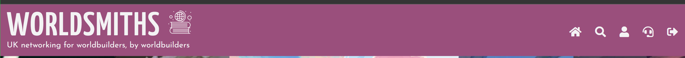

# Testing
Testing was conducted manually throughout development of the project. 

## Manual testing

### ***Base***

 Component   | Action      | Expected result | Result |
 ----------- | ----------- | --------------- | ------ |
 **Navigation** |
 USER NOT LOGGED IN |
 "Worldsmiths" | click | Takes user to homepage | pass
 Burger menu | click | Open side nav menu | pass
 "Home" | click | Takes user to homepage | pass
 "Home" | click | Item enlarges | pass
 "Sign in" | click |	Takes user to log in page |	pass
 "Sign in" | hover | Item enlarges|	pass
 "Sign up" | click | Takes user to sign up page | pass
 "Sign up" |	hover|	Item enlarges|	pass
"Get in touch"|	click|	Takes user to contact page|	pass
"Get in touch"	|hover|	Item enlarges|	pass
USER LOGGED IN			
"Search"|	clic|	Takes user to browse page	|pass
"Search"	|hover|	Item enlarges	|pass
"My profile"|	click|	Takes user to profile page| pass
"My profile"|	hover	|Item enlarges|	pass
"Sign out"	|click	|Signs user out, takes user to sign in page|pass
"Sign out"|	hover|	Item enlarges	pass
**Footer**
USER NOT LOGGGED IN
"Send us a raven"|	click|	Takes user to contact page	|pass
"Send us a raven"	|hover	|Background colour changes|	pass
"Sign in"	|click	|Takes user to log in page|	pass
"Sign up"	|click|	Takes user to sign up page|	pass
"Contact us"	|click	|Takes user to contact page	|pass
"Discord"	|click|	Takes user to Discord	|pass
"Patreon"|	click|	Takes user to Patreon	|pass
"Reddit"|	click	|Takes user to Reddit|	pass
"Instagram"	|click|	Takes user to instagram	|pass
"Twitter"	|click|	Takes user to Twitter|	pass
USER LOGGED IN			
"My profile"	|click|	Takes user to profile page|	pass
"Welcome page"|	click|	Takes user to welcome page|	pass
"Contact us"	|click|	Takes user to contact page|	pass

### ***Homepage***

 Component   | Action      | Expected result | Result |
 ----------- | ----------- | --------------- | ------ |
 USER NOT LOGGED IN
 "Join the quest* | click | Takes the user to sign up page | pass
 "Join the adventure | hover | Background colour changes | pass
 "...worldbuilding..." | hover | Tooltip appears below text | pass
 "Browse all groups and members" | type | Text appears in input | pass
 "Browse all groups and members" | click | Icon changes colour | pass
 "Browse all groups and members | click | Label leaves input | pass
 "Search" | click | Takes user to browse page with results | pass
 "Search" | hover | Background colour changes | pass
 "Browse all" | click | Takes user to browse page | pass
 "View group" | click | Sign in prompt modal appears | pass
 "View group | hover | Background colour changes | pass
 "Popular groups" | drag | Items will be dragged | pass
 "Heart icon" | hover | Tooltip will appear below | pass
 USER LOGGED IN 
 "Your profile" | click | Takes user to profile | pass
 "Your profile | hover | Background changes colour | pass
 "View group | click | takes user to group page | pass
 "View group | hover | Background changes colour | pass
 **Modal**
 "Join the adventure" | click |Takes user to sign up page | pass
 "Join the adventure" | hover| Background colour changes | pass
 "Sign me in" | click | Takes user to log in page | pass
 "Sign me in | hover | Background colour changes | pass

 ### ***Sign in***
  Component   | Action      | Expected result | Result |
 ----------- | ----------- | --------------- | ------ |
"Email" | click | Label leaves input | pass
"Email" | click | Icon changes colour | pass
"Email | type | Text appears in input | pass
"Password" | click | Label leaves input | pass
"Password | click | Icon changes colour | pass
"Password | type | Input appears in input | pass
"Password icon" | click | Password input switches visibility | pass
"Submit" |  click | Submits form, takes user to welcome page | pass
"Submit" | click | Flashes message if input is incorrect | pass
"Help, I can't speak "friend" and enter!" | click | Opens modal | pass
"Sign up here" | click | Takes user to sign up page | pass
**Modal**
"Email" | click | Icon changes colour | pass
"Email" | type | Text appears in input | pass
"Nevermind!" | click | Closes modal | pass
"Nevermind" | hover | Background changes colour | pass
"Send me a link" | click | Flash message appears | pass
"Send me a link" | hover | Background changes colour | pass

### ***Sign up***
 Component   | Action      | Expected result | Result |
 ----------- | ----------- | --------------- | ------ |
 "First name" | click | Label leaves input | pass
 "First name" | click | Icon changes colour | pass
 "First name" | click | Text appears in input | pass
 "Last name" | click | Label leaves input | pass
 "Last name" | click | Icon changes colour | pass
 "Last name" | click | Text appears in input | pass
 "Create account" | click | Submits form, takes user to welcome page | pass
 "Create account" | click | Flashes message if info inccorect | pass
 "Create account" | hover | Background changes colour | pass
 "Come on in" | click | Takes user to log in page | pass

### ***Welcome page***
 Component   | Action      | Expected result | Result |
 ----------- | ----------- | --------------- | ------ |
 "Homepage" | click | Takes user to homepage | pass
 "Homepage" | hover | Background changes colour | pass
 "My profile" | click | Takes user to profile page | pass
 "My profile" | hover | Background changes color | pass
 "Browse groups & members" | click | Takes user to browse page | pass
 "Browse groups & members" | hover | Background colour changes | pass
 "Contact us" | click | Takes user to contact page | pass
 "Contact us" | hover | Background colour changes | pass
 "Discord" | click | Takes user to Discord | pass
 "Reddit" | click | Takes user to Reddit | pass
 "Instagram" | click | Takes user to Instagram | pass
 "Twitter" | click | Takes user to Twitter | pass
 "Patreon" | click | Takes user to Patreon | pass

 ### ***Contact us***
  Component   | Action      | Expected result | Result |
 ----------- | ----------- | --------------- | ------ |
 "Full name" | click | Label leaves input | pass
 "Full name" | click | Icon changes colour | pass
 "Full name" | type | Text appears in input | pass 
 "Email" | click | Label leaves input | pass
 "Email" | click | Icon changes colour | pass
 "Email" | type | Text appears in input | pass
 "Reason for contact" | click | Label leaves input | pass
 "Reason for contact" | click | Icon changes colour | pass
 "Reason for contact" | type | Text appears in input | pass
 "Yor message" | click | Label leaves input | pass
 "Your message" | click | Icon changes colour | pass
 "Your message" | type | Text appears in input | pass
 "Submit" | click | Flashes message | pass
 "Submit" | hover | Backgrond colour changes | pass

### ***Browse***
  Component   | Action      | Expected result | Result |
 ----------- | ----------- | --------------- | ------ |
USER NOT LOGGED IN
"Browse all groups & members" | click | Input leaves input | pass
"Browse all groups & members" | click | Icon changes colour | pass
"Browse all groups & members" | type | Text appears in input | pass
"Search" | click | Displays user's results | pass
"Search" | click | Displays search confirmation message | pass
"Search" | hover | Background colour changes | pass
"Groups" tab | click | Takes user down the page to groups results | pass
"Groups" tab | hover | Background colour changes | pass
"Members" tab | click | Takes user down the page members results | pass
"Groups" tab | hover | Background colour changes
Group results namne | click | Toggles modal | pass
"View group" | click | Toggles modal | pass
"View group" | hover | Background colour changes | pass
Member results name | click | Toggles modal | pass
"Follow" icon | click | Toggles modal | pass
"Follow" icon | hover | Background colour changes | pass
**Modal**
"Join the adventure" | click |Takes user to sign up page | pass
"Join the adventure" | hover| Background colour changes | pass
"Sign me in" | click | Takes user to log in page | pass
"Sign me in | hover | Background colour changes | pass
USER LOGGED IN
Group results namne | click | Takes user to group page | pass
"View group" | click | Takes user to group page | pass
"View group" | hover | Background colour changes | pass
Member results name | click | Takes user to member page | pass
Member results name | click | If user, takes user to profile page | pass
"Follow" icon | click | Takes user to member page, flashes message | pass
"Follow" icon | hover | Background colour changes | pass
"Unfollow" icon | click | Takes user to member page, flashes message | pass
"Unfollow" icon | hover | Background colour changes | pass

### ***Profile***
  Component   | Action      | Expected result | Result |
 ----------- | ----------- | --------------- | ------ |
 "Edit profile" | click | Takes user to edit profile page | pass
 "Edit profile" | hover | Background colour changes | pass
 "Settings" | click | Takes user to settings page | pass
 "Settings" | hover | Background colour changes | pass
 "Create group" | click | Takes user to create group page" | pass
 "Create group" | hover | Background colour testing | pass
 Group name (owned) | click | Takes user to group page | pass
 Group name (memebr of) | click | Takes user to group page | pass
 Memebr name (following) | click | Takes user to member page | pass

### ***Member page***
  Component   | Action      | Expected result | Result |
 ----------- | ----------- | --------------- | ------ |
"Follow" | click | Flashes message, changes to "Unfollow" | pass
"Unfollow" | click | Flashes message, changes to "Follow" | pass
Group name (owned) | click | Takes user to group page | pass
Group name (member of) | click | Takes user to group profile | pass
Member name (following) | click | Takes user to member profile | pass

### ***Profile settings***
  Component   | Action      | Expected result | Result |
 ----------- | ----------- | --------------- | ------ |
"New email" | click | Label leaves input | pass
"New email" | type | Text appears in input | pass
"Confirm email" | click | Label leaves input | pass
"Confirm email" | type | Text appears in input | pass
"New password" | click | Label leaves input | pass
"New password" | type | Text appears in input | pass
"New first name" | click | Label leaves input | pass
"New first name" | type | Text appears in input | pass
"New last name" | click | Label leaves input | pass
"New last name" | type | Text appears in input | pass
"Save" | click | Flashes message, updates info | pass
"Save" | hover | Background colour changes | pass
"Delete account" | click | Toggles modal | pass
**Modal**
"I've changed my mind!" | click | Closes modal | pass
"I've changed my mind!" | hover | Background colour changes | pass
"Delete my precious" | click | Deletes user's account, takes user to sign up page, flashes message | pass

### ***Edit profile***
  Component   | Action      | Expected result | Result |
 ----------- | ----------- | --------------- | ------ |
All pre-filled labels | type | Text appears in input | pass
"TELL US ABOUT YOUR WORLDBUILDING WORK (WHAT INSPIRES YOU, YOUR WORLDS ETC...)" | click | Label leaves input | pass
"TELL US ABOUT YOUR WORLDBUILDING WORK (WHAT INSPIRES YOU, YOUR WORLDS ETC...)" | type | Text appears in input | pass
"TELL US ABOUT YOU" | click | Text appears in input | pass
"Save" | click | Save user info, takes user to profile, flashes message" | pass

### ***Create group***
  Component   | Action      | Expected result | Result |
 ----------- | ----------- | --------------- | ------ |
 "Group name" | click | Label leaves input | pass
 "Group name" | type | Text appears in input | pass
"Group location" | click | Label leaves input | pass
 "Group location" | type | Text appears in input | pass
  "Group description" | click | Label leaves input | pass
 "Group description" | type | Text appears in input | pass
  "Group banner image" | click | Label leaves input | pass
 "Group banner image" | type | Text appears in input | pass
 "Cancel" | click | Takes user to homepage | pass
 "Cancel" | hover | Background changes colour | pass
 "Save" | click | Creates group, takes user to profile page, flashes message | pass
 "Save" | hover | Background changes colour | pass

### ***Group***
  Component   | Action      | Expected result | Result |
 ----------- | ----------- | --------------- | ------ |
OWNER
"Edit group" | click | Takes user to edit group page | pass
"Edit group" | hover | Background changes colour | pass
"Delete" | click | Triggers modal | pass
NON-OWNER
"Join" | click | Flashes message, changes to "Leave" | pass
"Leave" | click | Flashes message, changes to "Join" | pass
Member name (following) | click | Takes user to member profile | pass
"Follow" | click | Takes user to member profile, flashes message | pass
"Follow" | hover | Background colour changes | pass
"Unfollow" | click | Takes user to member profile, flashes message | pass
"Unfollow" | hover | Background colour changes | pass
Pagination | click | Displays last or next 6 members on page | pass
"Add comment" | click | Triggers modal | pass
"Add comment" | hover | Background colour changes | pass
"Reply" | click | Triggers modal | pass
"Delete" | click | Triggers modal | pass
**Modal - delete**
"I've changed my mind!" | click | Closes modal | pass
"I've changed my mind!" | hover | Background colour changes | pass
"Delete my precious" | click | Deletes group, takes user to profile page, flashes message | pass
**Modal - comment**
Input | click | Icon changes colour | pass
Input | type | Text appears in input | pass
"Add" | click | Takes user to group page, flashes message, comment appears | pass
**Modal - reply**
Input | click | Icon changes colour | pass
Input | type | Text appears in input | pass
"Add" | click | Takes user to group page, flashes message, comment appears | pass
**Modal - delete**
"Be rid of it" | click | Takes user to group page, flashes message, comment removed | pass

### ***Edit group***
  Component   | Action      | Expected result | Result |
 ----------- | ----------- | --------------- | ------ |
 "Group name" | click | Label leaves input | pass
 "Group name" | type | Text appears in input | pass
  "Group location" | click | Label leaves input | pass
 "Group location" | type | Text appears in input | pass
  "Group description" | click | Label leaves input | pass
 "Group description" | type | Text appears in input | pass
  "Banner image" | click | Label leaves input | pass
 "Banner image" | type | Text appears in input | pass
 "Save" | click | Saves info, flash message | pass

--- 

 # User stories 

* I want a responsive website so I can access it on a range of different devices
* **Result:** PASS

* I want to easily navigate across the site so I can find the information / page that I need
* **Result:** PASS

* I want to browse the site to see if the website is something I want to join
* **Result:** PASS

* I want to be able to see group descriptions
* **Result:** PASS

* I want to be able to sign-up so that I can create my profile and start networking
* **Result:** PASS

* I want to be able to log-in so that I can make use of the website and its features
* **Result:** PASS

* I want to be able to create and edit my profile so that I can update my personal information 
* **Result:** PASS

* I want to be able to delete my profile
* **Result:** PASS

* I want to be able to leave a comment on the group page so I can connect with participants & organisers 
* I want members to be able to leave comments and chat freely in the group so that any questions they have can be answered
* I want to be able to leave comments or questions in the group so that I can have all the information I need 

* I want to be able to join a group to network with other members
* I want to be able to see the number of members on the profile
* I want to be able to join a group so that I can connect with other members
* **Result:** PASS

* I want to be able to view other people's profiles so that I can connect with them and view their projects
* **Result:** PASS

* I want to be able to share my social media or project information on my profile so that other members can see my work
* **Result:** PASS

* I want to be able to create a group so that I can network with other members
* **Result:** PASS

* I want to view the groups that I have created so that I can edit the details or delete it if necessary
* I want to be able to see the number of members on the profile
* I want to be able to view the groups that I am part of
* **Result:** PASS

* I want to provide all the relevant group details that will be of use to attendees (admin, location, description etc)
* **Result:** PASS

* I want to be able to leave the group if I change my mind
* **Result:** PASS

# Responsiveness
This project was tested on a variety of devices:
* iPhone 11
* Samsung tablet
* iPhone 7
* Google Pixel 4

***Responsive view***

This project was also tested on the following providers and responded well: 
* Google Chrome
* Microsoft Edge
* Safari
* Opera
* Firefox

# Major bugs & solutions
**[1]**
* **Issue:** "Edit" modal wouldn't respond (404 errors)
* **Solution:** Rendering edit pages on different pages instead rather than modals

**[2]**
* **Issue:** The view function for 'reset_password' did not return a valid response. The function either returned None or ended without a return statement.
* **Solution:** Simply added return statement, simply rendered the sign-in page again

**[3]**
* **Issue:** werkzeug.builderrors after refactoring
* **Solution:** Route paths needed to be included with dot notation in url_for paths in base.html

**[4]**
* **Issue:** 'Collection' object is not callable. If you meant to call the 'remove_one' method on a 'Collection' object it is failing because no such method exists whilst trying to remove user from group members
* **Solution:** remove_one does not exist as a function, I meant update_one

**[5]**
* **Issue:** Contact form not working - returning Connection Error errno 1111
* **Solution:** Use SendGrid as per mentor's suggestions