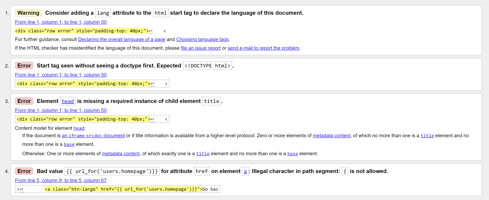
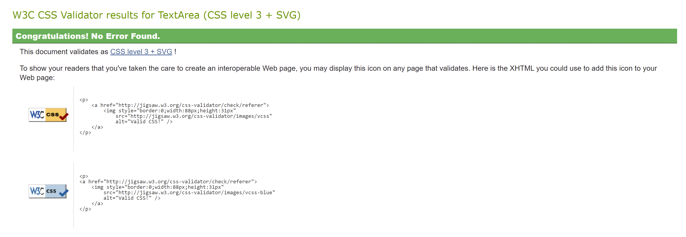

# Validation

## **HTML - W3C HML validator**

W3C HTML validator returns the Jinja templating as bad values, such as {{ url_for }},  and missing DOCTYPE etc. These errors (like below) can be ignored:



This list contains errors that were immediately fixable within the HTML.

---

### ***Error handling pages***

Errors produced:

* All three (403.html, 404.html and 500.html) produce the same error messages which are flagging Jinja as incorrect syntax

Action taken:
* Ignore

### ***all-groups-members.html***

Errors produed:
* Stray ``` </a> ``` tag
* End tag ```div``` seen, but there were open elements
* Unclosed element ```div```
* Unclosed elemnt ```div```

Action taken:
* HTML fixed and errors resolved

### ***base.html***
Errors prouced:
* Stray end tag ```i```

Action taken:
* HTML fixed and errors resolved

### ***contact.html***

Errors produced:
* A slash was not immediately followed by ```>```
* Element ```p``` not allowed as child of element ```i``` in this context
* End tag ```div``` seen, but there were open elements
* Unclosed element ```i```
* Unclosed element ```h3```
* Duplicate attribute ``id`` (3x)

### ***create-group.html***

No errors produced, no action needed

### ***edit-group***

No errors produced, no action needed

### ***edit-profile***

Errors produced:
* The value of the ```for``` attribute of the ```label``` element must be the ID of a non-hidden form control

Action taken: 
* HTML fixed and errors resolved

### ***group.html***

Errors produced:
* Stray end tag ```span```
* Stray end tag ```textarea``` (2x)
* Stray end tag ```input``` (2x)
* Bad value for attribute ```action``` on element ```form```: Must be non-empty
* An ```img``` element must have an ```alt``` attribute, except under certain conditions
* Stray end tag ```a``` (3x)
* Unclosed element ```div```

Action taken:
* HTML fixed and errors resolved


### ***homepage.html***

Errors produced:
* Bad value for attribute ```action``` on element form: Must be non-empty (2x)
*  Stray end tag ```a``` (2x)
* Unclosed element ```button``` (2x)

Action taken:
* HTML fixed and errors resolved

### ***log-in.html***

Errors produced:
* Duplicate attribute ```id```

Action taken:
* HTML fixed and errors resolved

### ***member.html***

Errors produced:
* Attribute ```target``` not allowed on element ```div``` at this point (3x)
* Possible misuse of ```aria-label``` (3x)
* An ```img``` element must have an ```alt``` attribute, except under certain conditions

Action taken:
* HTML fixed and errors resolved

### ***profile-settings.html***

Errors produced:
* Stray end tag ```a```
*  Unclosed element ```button```

Action taken:
* HTML fixed and errors resolved

### ***profile.html***

Errors produced:
*  An ```img``` element must have an ```alt``` attribute, except under certain conditions (3x)
* Duplicate attribute ```class```

Action taken:
* HTML fixed and errors resolved

### ***sign-up.html***

Errors produced:
* An ```img``` element must have an ```alt``` attribute, except under certain conditions

Action taken:
* HTML fixed and errors resolved

### ***welcome.html***

Errors produced:
* An ```img``` element must have an ```alt``` attribute, except under certain condition

Action taken:
* HTML fixed and errors resolved
 
---

## **CSS - W3C CSS validator**

Errors produced:
* ```Font-size``` must be a unit

Action taken:
* CSS fixed and errors resolved



---

## **JavaScript - JSHint**
The JSHint did not recognise the jQuery ```$``` as a variable, so these warnings were ignored.

Errors produced:
* Missing semi-colon ```;```

Action taken:
* JS fixed and errors resolved

---

## **Python - PEP8 Online***

### ***settings.py***

Errors produced:
* No newline at end of file

Action taken:
* Python file fixed and errors resolved

### ***__init__.py***

Errors produced:
* Trailing whitespace
* Blank line at end of file

Action taken:
* Python file fixed and errors resolved

### ***users.py***

Errors produced:
* Line too long
* Trailing whitespace
* Continuation line under-indented for visual indent

Action taken:
* Python file fixed and errors resolved

### ***main.py***

Errors produced:
* Line too long
* Continuation line under-indented for visual indent
* Continuation line over-indented for visual indent

Action taken:
* Python file fixed and errors resolved

### ***groups.py***
* Line too long
* Blank line contains whitespace
* Continuation line over-indented for visual indent
* Trailing whitespace

Action taken:
* Python file fixed and errors resolved

### ***user.py***
* Continuation line under-indented for visual indent
* Too many blank lines (2)
* Continuation line over-indented for visual indent
* Blank line contains whitespace
* Line too long

Action taken:
* Python file fixed and errors resolved

### ***group.py***
* Continuation line over-indented for visual indent
* Too many blank lines (2)

Action taken:
* Python file fixed and errors resolved

### ***comment.py***
* Continuation line under-indented for visual indent
* Too many blank lines (2)
* Blank line contains whitespace
* Line too long (91 > 79 characters)

Action taken:
* Python file fixed and errors resolved


